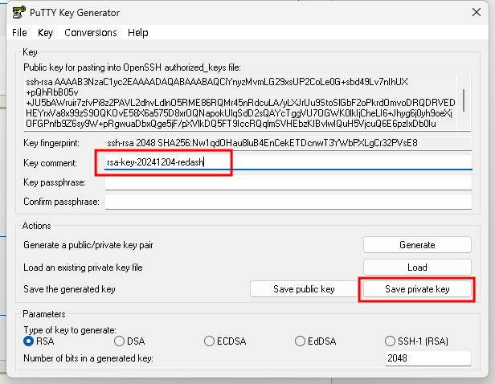
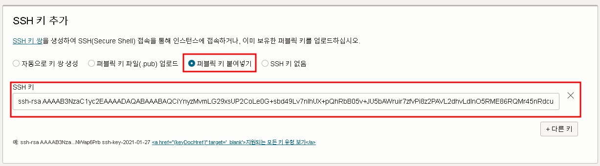

# 오라클 인스턴스 컴퓨터 생성 & SSH
## 1. ssh key generator
- 
- Key comment : key에 대한 설명으로 해당 key가 하는 역할에 대해서 자유롭게 입력하면 된다.
- key passphrase : key만으로 로그인하는 것이 불안한 경우 key에 대한 비밀번호를 설정할 수 있다. 보안을 위해 입력하는 것이 좋다.
- public key : 서버 쪽에 등록할 때 사용 (자물쇠)
- private key : 서버로 접속하는 클라이언트에서 사용하는 key (열쇠)     

## 2. 생성한 public key 를 붙여넣는다.
- 

mv rsa-key-20241204-redash.pub .ssh/rsa-key-20241204-redash.pub
mv rsa-key-20241204-redash.ppk .ssh/rsa-key-20241204-redash.ppk

158.180.72.147

ssh -i .ssh/ssh-key-2024-12-04-redash.key ubuntu@150.230.253.237

ssh -i .ssh/rsa-key-20241204-redash.pub ubuntu@158.180.72.147

chmod 400 .ssh/ssh-key-2024-12-04-redash.key
chmod 400 .ssh/rsa-key-20241204-redash.pub

ssh -i ssh-key-2024-12-04-redash.key ubuntu@150.230.253.237

mv ssh-key-2024-12-04-redash.key .ssh/ssh-key-2024-12-04-redash.key
